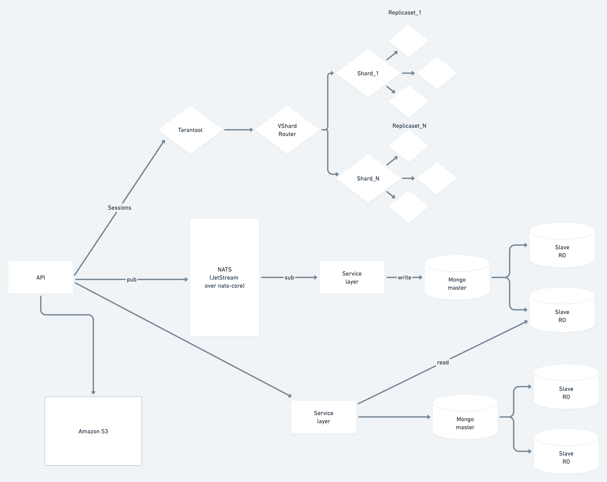
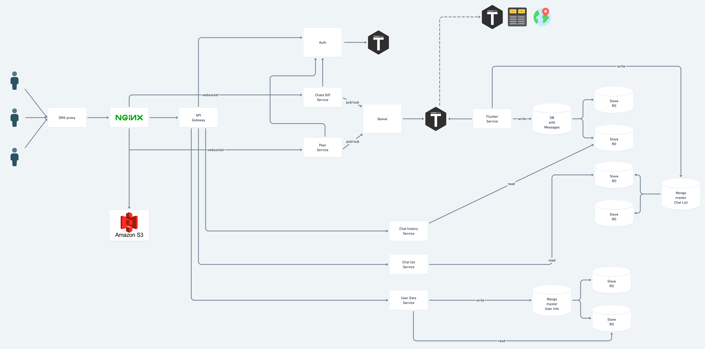

# highload_chat_design

## 1. Тип сервиса, функционал MVP и целевая аудитория

Тип сервиса: мессенджер

MVP:
- отправка сообщений
- список чатов
- каналы
- группы
- диалоги
- история сообщений
- регистрация по номеру телефона

Целевая аудитория:
- РФ и страны СНГ (10 мин в день)
- Европа
- Северная и Южная Америка

## 2. Расчет нагрузки
### Продуктовые метрики
 - Месячная аудитория: 500 млн активных пользователей
 - Дневная аудитория: 350млн со всего мира, 40 млн активных пользователей из России
 - Средний размер хранилища пользователя:
    * Данные о пользователе (номер телефона, никнейм, дата регистрации, последняя активность, аватар (в ср. 1-2 фотографии)) - 11Б + 10Б + 20КБ + 20КБ = 40кБ
    * Сообщения пользователя (40 сообщений в день 35 текстовых + 3 голосовых + 2 медиа) = (35 * 50Б) + (3*160кБ (1мин)) + (2*250кБ) = 880+1750 = 3630кБ
    * Сообщения пользователя будем хранить всегда (5 лет) - 3630 * 182*10 = 6гБ
    * Список чатов, групп и каналов пользователя [(Название элемента) 15Б + (последнее сообщение) 20Б + (время) 5Б] * 20 = 800Б = 8кБ
    * Всего на одного пользователя: 48кБ + 8кБ + 662мБ = 6гБ
   - Среднее количество действий пользователя по типам в день (типы запросов выбираем на основании выбраного функционала MVP) Оформить в виде сводной таблицы

     Действие                                          | Среднее кол-во в день
     ------------------------------------------------- | -------------
     Отправка сообщения (в том чилсе пост в канале)    | 20
     Получение сообщения                               | 40

     Действие             | Среднее кол-во в месяц
     -------------------- | ----------------------
     Создание чата        | 1
     Добавление в чат     | 2
   
### Технические метрики
 - Размер хранения в разбивке по типам данных (в Тб) - для существенных блоков данных
    На одного пользователя за 5 лет требуется хранить 6ГБ, соответственно на 500 млн пользователей:
    6ГБ * 500млн = 300 000 ТБ
 - Сетевой трафик
    Основная нагрузка приходится на сообщения, рассмотрим трафик по типам сообщений

    Тип          | Отправка (дневаня аудитория 300 млн) | Отправка Тб/сутки | Получение (из-за какналов и групповых чатов возьмем доп. эмпирич. коэф.) Тб/сутки 
   ------------- |--------------------------------------|-------------------|-----------------------------------------------------------------------------------|
   Текстовое     | 35 * 300млн * 0.05кБ                 | 0.52              | 0.52 * 8 = 4.16                                                                   |
   Голосовое     | 3 * 300млн * 160кБ                   | 134               | 134 * 3 = 402                                                                     |
   Файл          | 2 * 300млн * 250кБ                   | 139               | 139 * 5 = 695                                                                     |

 RPS в разбивке по типам запросов (запросов в секунду) - для основных запросов Оформить в виде сводной таблицы.
 
 - Отправка сообщения: 300млн * 35/86400 = 121 500 RPS
 - Получение сообщения: 300млн * 35 * 8/86400 = 972 222 RPS
 - Добавление в групповой чат: 300млн * (2/30) /86400 = 250 RPS
 - Подписка на канал(в мес подписка на 3 канала): 300млн * (3/30) /86400 = 350 RPS
 - Создание чата/канала (в мес создание 1 канала/чата от пользователя): 300млн * (1/30) /86400 = 115 RPS

   Действие                            | RPS
   ------------------------------------| ---
   Отправка сообщения                  | 121 500
   Получение сообщения                 | 972 222
   Подписка на канал                   | 250
   Добавление в групповой чат          | 350
   Создание чата/канала                | 115

## 3. Логическая схема

## 4. Физическая схема

- Amazon S3 используется для хранения и раздачи медиа файлов и всей статики.
- В Tarantool храним сессии пользователей, будет использоваться как key-value хранилище с шардингом по VShard.
- Для реализации очереди сообщений будет использоваться встроенная в NATS система JetStream которая расширяет nats-core
и дает персистентность и надежность хранения сообщений в очереди наряду с тем, что сам nats-server дает хорошую 
производительность по сравнению с аналогами в виде RabbitMQ.
- В mongoDB будем хранить данные пользователей, сообщения, списки чатов и посты в каналах. 
При заданной нагрузке базу необходимо шардировать со старта. Разбивать на базы и шарды будем по нагрузке. Схема репликации master-slave
Данные пользователей и списки чатов будем хранить в отдельной базе. Данные пользователей и списки чатов будем шардировать по id пользователя.
Сообщения и посты будем также хранить в отдельной базе. Разбивать на шарды будем по id чата и канала.

## 5. Технологии
   - JavaScript - для написания фронтенда приложения
   - React - для упрощения разработки фронтенда 
   - Golang - для разработки всех сервисов 
   - Tarantool Cartridge - для кеша, хранения сессий
   - MongoDB - для хранения данных пользователей, чатов и каналов
   - Nginx - reverse proxy, раздача статики, балансинг на уровне L7
   - NATS - для реализации сервиса сообщений

## 6. Схема проекта

## 7. Список серверов
Для распределения нагрузки предлагается завести 4 датацентра
- Северная Америка (Нью-Йорк)
- Южная Америка (Сан Пауло)
- Европа (Амстердам)
- Индия (Мумбаи)

Amazon S3
- Необходимо хранить файлы и аудио файлы, их размер составляет около 220 000 Тб
- В одном бакете хранится 5 Тб данных, значит потребуется 44к бакетов

Сервера для сервисов:

- Для баз данных нужны сервера с увеличенным относительно остальных кофнигураций размером диска.
- Для тарантула можно взять сервер с небольшим количестом ядер и размером диска, но увеличенной объемом памяти.
- Для сервиса чата и nats-server нужна конфигурация с большим количеством ядер и памяти.
- Для остальных сервисов достаточно стандартной конфигурации.

Сервис                                  | Кол-во серверов | Тип сервера
----------------------------------------|-----------------| -----------
Nginx                                   | 10              |
Auth                                    | 10              |
Gateway                                 | 25              |
Message service                         | 35              |
Chat service                            | 10              |
Chanel posts service                    | 10              |
User Data, Chat and Chanel List service | 10              |

## 8. Источники
1. https://docs.nats.io/nats-concepts/jetstream
2. https://www.tarantool.io/ru/doc/latest/reference/reference_rock/vshard/
3. https://habr.com/ru/company/vk/blog/436916/
4. https://github.com/tarantool/crud/#insert
