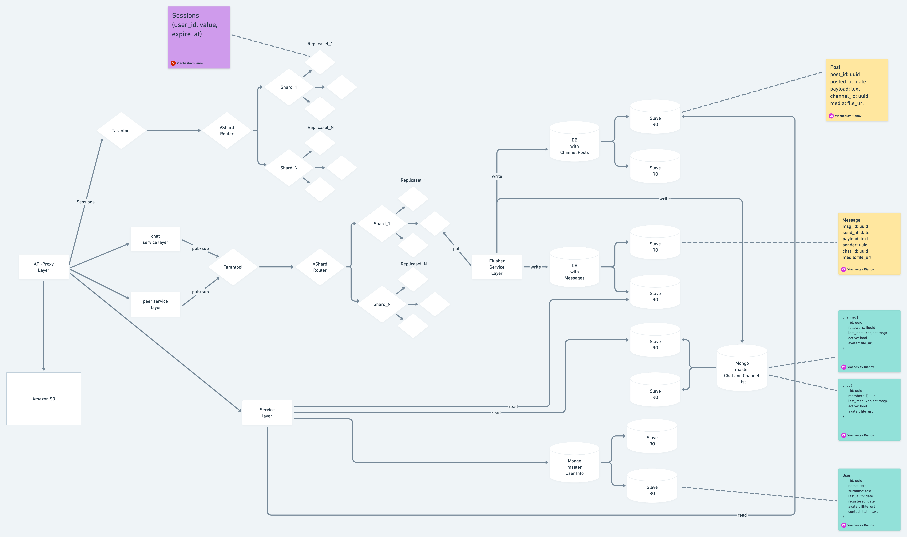
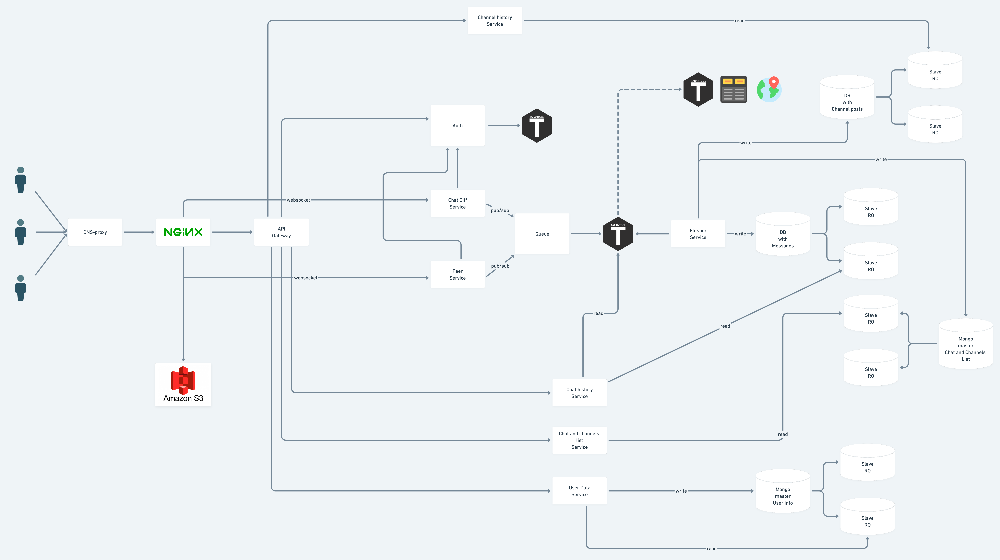

# highload-chat-design

## 1. Service type, MVP functionality and target audience

Service type: messenger

MVP:
- Sending messages
- Chat list
- Channels
- Groups
- Dialogues
- Message history
- Phone number registration

Target audience:
- Russia and CIS countries (10 minutes per day)
- Europe
- North and South America
- South Asia

## 2. Load calculation
### Product metrics
- Monthly audience: 500 million active users
- Daily audience: 350 million worldwide, 40 million active users from Russia
- Average user storage size:
    * User data (phone number, nickname, registration date, last activity, avatar (1-2 photos on average)) - 11B + 10B + 20KB + 20KB = 40KB
    * User messages (40 messages per day, 35 texts + 3 voice + 2 media) = (35 * 50B) + (3 * 160KB (1 min)) + (2 * 250KB) = 880 + 1750 = 3630KB
    * User messages will be stored indefinitely (5 years) - 3630 * 182 * 10 = 6GB
    * User's chat, group, and channel list [(Element name) 15B + (last message) 20B + (time) 5B] * 20 = 800B = 0.8KB
    * Total per user: 6GB
- Average number of user actions by type per day (types of requests are chosen based on selected MVP functionality). Summarized in the form of a summary table.

     Action                                          | Average per day
     ------------------------------------------------- | -------------
     Sending message (including channel posts)          | 20
     Receiving message                                 | 40

     Action             | Average per month
     -------------------- | ----------------------
     Creating a chat        | 1
     Adding to a chat     | 2

### Technical metrics

- Storage size breakdown by data types (in TB) - for significant data blocks

    For one user over 5 years, 6GB of storage is required. Therefore, for 500 million users:
    6GB * 500 million = 3,000,000 TB
    For Russia and the CIS, for 40 million users:
    6GB * 40 million = 234,000 TB
    Files will be stored in S3, and text messages and other information will be stored in text format
    In the database, this will be: 3MB * 500 million = 1,430 TB
    For Russia: 3MB * 40 million = 114 TB

- Network traffic
    The main load is on messages, let's consider the traffic by message types

    Type           | Sending (daily audience of 300 million) | Sending TB/day | Receiving (taking into account channels and group chats, we will take an additional empirical coefficient) TB/day 
   --------------- |---------------------------------------|----------------|----------------------------------------------------------|
   Text            | 35 * 300 million * 0.05KB               | 0.52           | 0.52 * 8 = 4.16                                         |
   Voice           | 3 * 300 million * 160KB                 | 134            | 134 * 3 = 402                                           |
   File            | 2 * 300 million * 250KB                 | 139            | 139 * 5 = 695                                           |

For peak load (500 million active users):

Type           | Sending                             | Sending TB/day | Receiving (taking into account channels and group chats, we will take an additional empirical coefficient) TB/day 
---------------|--------------------------------------|----------------|----------------------------------------------------------|
Text           | 35 * 500 million * 0.05KB             | 0.88           | 0.88 * 8 = 7.04                                         |
Voice          | 3 * 500 million * 160KB               | 240            | 240 * 3 = 720                                           |
File           | 2 * 500 million * 250KB               | 250            | 250 * 5 = 1250                                          |

RPS breakdown by types of requests (requests per second) - for main requests. Present as a summary table.
Calculation is done for peak load (500 million users).

- Sending a message: 500 million * 35/86400 = 202,500 RPS
- Receiving a message: 500 million * 35 * 8/86400 = 1,620,222 RPS
- Adding to a group chat: 500 million * (2/30) /86400 = 400 RPS
- Subscribing to a channel (monthly subscription to 3 channels): 500 million * (3/30) /86400 = 570 RPS
- Creating a chat/channel (monthly creation of 1 channel/chat per user): 500 million * (1/30) /86400 = 195 RPS

   Action                             | RPS
   -----------------------------------| ---
   Sending a message                  | 202,500
   Receiving a message                | 1,620,222
   Subscribing to a channel           | 400
   Adding to a group chat             | 570
   Creating a chat/channel            | 195

## 3. Logical schema

## 4. Physical schema

### MessageDB

To store messages, it is proposed to write a custom database with the required data storage schema.
In addition to the standard requirements for databases regarding ACID, there is a need to store messages in chats in such a way that the chat data is physically located close together on the disk.
The main scenario for working with the database is to add a message to the end of a chat.
The database should support a replication mechanism and virtual sharding.

It is desirable to have support for indexes useful for working with messages.
These include B+ tree, HASH, and inverted lists.

An index is needed for the message date.

Based on the CAP theorem, the aim is to implement an AP system because there should be no consistency problems, as they are resolved before all messages are flushed to disk, and eventual consistency is sufficient.

To solve consensus problems, a Raft mechanism will be implemented.

### PostDB
The same database, but with a slightly different data schema.

### Sharding

Tarantool Auth - shard by `user_id`

MongoDB Users - shard by `user_id`

MongoDB Chat and Channels - shard by `_id`

MessagesDB - shard by `chat_id`

PostsDB - shard by `channel_id` of the channel

### Indexes

Tarantool Auth - HASH index by 'user_token' + HASH index by user_id

MongoDB Users - index by `name` for full-text search

MongoDB Chat - only primary index is needed

MongoDB Channels - index for full-text search

MessagesDB - index for full-text search in messages

PostsDB - index for full-text search in messages

### Chat and channel engine schema based on Tarantool

Schema for peer-to-peer conversation queue:

Schema for subscribing to chat updates from the chat list:

Schema for shared chat queue:

- Amazon S3 is used for storing and distributing media files and all static content.
- Tarantool is used to store user sessions, and it will be used as a key-value store with VShard sharding.
- Messages queues for chats, groups, and channels will be implemented based on Tarantool, with replication and sharding of message queues across shards.
A stored procedure will be implemented to take a snapshot of the queue state, so that the Flusher service can request this state and save it to a persistent database.
Replication between data centers will be implemented to speed up conversations between geographically separated users.
- MongoDB will be used to store user data, messages, chat lists, and channel posts.
When there is a given load, the database needs to be sharded from the start. Sharding will be done based on load. Master-slave replication scheme.
User data and chat lists will be stored in a separate database, and they will be sharded by user ID (updated by message ID).
Messages and posts will also be stored in a separate database. Sharding will be done based on chat and channel IDs.

## 5. Technologies
   - JavaScript - for frontend application development
   - React - for simplifying frontend development
   - Golang - for developing all services
   - Tarantool Cartridge - for cache, session storage, in-memory platform for implementing custom chat and channel message queue
   - MongoDB - for persistent storage of user data, chats, and channels
   - Nginx - reverse proxy, static content delivery, L7 load balancing, websocket proxying

## 6. Project Architecture

## 7. Server List
To distribute the load, it is proposed to have 4 data centers:
- North America (New York)
- South America (Sao Paulo)
- Europe (Amsterdam)
- India (Mumbai)

Amazon S3
- Files and audio files need to be stored, with a size of approximately 220,000 TB.
- 5 TB of data is stored in one bucket, so 44k buckets will be required.

Servers for services:

- For databases, servers with larger disk sizes relative to others are needed.
- For Tarantool, a server with a small number of cores and disk size, but an increased amount of memory can be used.
- For other services, a standard configuration is sufficient.

The calculation of the number and configuration of servers is performed for the Russia and CIS region as the reference.
For other regions, the numbers are adjusted according to the correction coefficient, which depends on the difference in DAU.

### Peer service
This service should be able to maintain WebSocket connections with users, so the maximum possible number of connections per server must be taken into account. With proper tuning of Linux machines (maximizing the number of open file descriptors per process), it can be configured to allow for approximately 65k connections to one server. Therefore, the number of servers per region can be calculated based on peak load, i.e. DAU: 40,000,000 / 65,000 ~= 615.

The size of one message is approximately 50B. Therefore, at peak load (if each user receives 3 messages per second), only 72 Mbps will pass through one server, which is sufficient for a standard 10 Gbps interface.

### Chat diff service
This service will also maintain WebSocket connections with users.

The number of servers is assumed to be approximately the same - 615.

The traffic is approximately as follows (on average, 8 chats are updated simultaneously):

50B * 8 * 65,000 = 72 Mbps, which is sufficient for a standard 10 Gbps interface for each server.

### Chat and Channel List service
RPS: 100,000

The volume of one request is extracting the list of messages for one user.

Volume - chat record * (number of user chats + number of channels) = 120B * (30 + 20) = 5.7 KB.

Traffic - 4 Mbps.

Quantity - 8.

### Chat and Channel history service
Calculation is done based on the load on this service.

On average, a user requests chat history 50 times per day.
For each chat history, 5 messages are requested. On average, there are 20 history requests per chat.
Approximately, RPS = (40 million * 50 * 20) / (24 * 3600) ~= 460,000 RPS.

Accepting RPS: ~500,000

Query volume - (10 messages * 50B) = 500B.

Required bandwidth: 3.73 Gbps - a 10 Gbps interface is sufficient.

Quantity: 8.

### User Data
On average, a user retrieves their data 1 time.

Information about other users is retrieved on average 20 times.

RPS: 10,000

Number of servers: 2

Taking the standard configuration with a 10 Gbps interface, 32 GB RAM, and 256 GB disk.

### Auth
The authentication service is accessed from different system services to validate user tokens.

The service is accessed for each request to the Gateway and for each connection to Chat diff and Peer Service.

As a result, we obtain an approximate RPS count.

RPS: 1,000,000

A string with a 16-byte payload is provided as input.

The required throughput is 0.12 Gbps (slightly more with HTTP included).

Number of servers: 4

### Nginx to S3
RPS: 1,000,000

One server can handle ~90,000 RPS with a 100 KB payload.

k = 1.8 - empirical safety factor

Number of servers: 1,000,000 * k / 90,000 = 14

To transmit different data types from images to messages, we use bonding at 40 Gbps.

### Gateway
The total number of requests from a single user in one day:
50 * 20 (Chat history) + 50 * 20 (Channel history) + 21 (User Data) + 1 (Chat list) + 1 (Channel list) = 2024 requests

Approximate RPS: (40 million * 2024) / (24 * 3600) ~= 1,000,000 RPS

RPS: 1,000,000

k = 2

Number of servers: 1,000,000 * k / 90,000 = 20

### Tarantool auth
Need to store: 40 million * (100 bytes - database record) = 3 GB

A configuration with 16 GB memory is sufficient. One master and two replicas can be used.

### Tarantool queue
Need to consider the maximum amount of data the system should handle and for how long.

In half a day (12 hours - assumed time for flusher), the service receives (40 million * 40 messages) / 2 = 800 million messages, on average 50 bytes each. This means the required data storage capacity in memory is approximately 40 GB, so a single data center can comfortably accommodate 6 (2 master shards + 2 replicas) Tarantool servers with 32 GB of memory and standard network interfaces. Disk memory is also needed only for storing snapshots and xlog.

### MessageDB

The main load is on this database. The load is mainly read-oriented.

Let's calculate the number of RPS. In a day, a user receives about 150 messages from their message history.

So, the total load on the database is: (40 million * 150) / 24 * 3600 = 70,000 RPS

To calculate the number of instances, we will calculate the number of shards needed to handle a load of 70k RPS.

Approximately, the QPS for the database can be taken as 3000 QPS if the data is stored on SSD drives.

So, the number of shards required is approximately: 70,000 / 3000 ~= 24.

Each shard will have 1 master and 2 replicas.

In the end, we get 72 servers.

The average number of messages per chat in 5 years will be 18,250. In terms of volume, that's 18,250 * 100B ~= 2MB

So, for the audience in Russia, it will be: 40 million * 2MB ~= 76TB.

Therefore, each shard will require approximately 1TB of disk space. If we consider a configuration with RAID 10 and 16 disks of 2TB each, we will have 16TB per machine, so there will be a large margin.

### ChatDB

Similar to MessageDB.

### Mongo DB User Data
Let's calculate based on the volume of data that needs to be stored.

Storage volume for all users in the region: 40 million * 200B ~= 8GB

To store 8GB (textual data volume per user), we will use a server with RAID 10 and 8 NVMe 1TB drives.

RPS for the service interacting with the database: 10,000

One MongoDB instance can handle approximately 2000 QPS.

So, the number of shards should be around 5 + one replica for each shard.

Total: 10.

### Mongo DB Chats and Channels

Let's calculate based on the volume of data and the load.

On average, there are about 50 chats per group of 10 people.

Let's assume the entire region is divided into groups of 10 people. We also need to consider the connection between these groups and have a safety factor because the number of chats can be significantly higher.

k = 10

Storage volume: 200B (record size) * (4 million * 50) * k ~= 0.36TB

To store 0.36TB, a server with RAID 10 and 16 NVMe 1TB drives is sufficient.

RPS for the service interacting with the database: 500,000

For MongoDB, we can assume a QPS of about 2000.

So, to handle a load of 500,000, we need approximately 500,000/2000 = 250.

Total: 250 shards + 1 replica for each = 500.

Service                                  | Number of Servers per DC | RAM | CPU     | Storage               | Network
----------------------------------------|-----------------------------|-----|---------|-----------------------| -------
Nginx                                   | 20                          | 32  | 8 cores | 512GB SSD             | 40 Gbps
Auth                                    | 4                           | 32  | 8 cores | 256GB HDD             | 10 Gbps
Gateway                                 | 20                          | 32  | 8 cores | 256GB HDD             | 10 Gbps
Tarantool auth                          | 3                           | 32  | 8 cores | 256GB SSD             | 10 Gbps
Tarantool queue                         | 5                           | 32  | 8 cores | 256GB SSD             | 10 Gbps
Peer service                            | 615                         | 16  | 8 cores | 256GB HDD             | 10 Gbps
Chat diff service                       | 615                         | 16  | 8 cores | 256GB HDD             | 10 Gbps
Chanel posts service                    | 4                           | 16  | 8 cores | 256GB HDD             | 10 Gbps
User Data                               | 4                           | 16  | 8 cores | 256GB HDD             | 10 Gbps
Chat and Chanel List service            | 8*2                         | 16  | 8 cores | 256GB HDD             | 10 Gbps
Chat and Chanel history service         | 8*2                         | 16  | 8 cores | 256GB HDD             | 10 Gbps
Flusher service                         | 1                           | 16  | 8 cores | 256GB HDD             | 10 Gbps
Mongo DB Chats and Channels             | 500                         | 64  | 8 cores | RAID 10 4TB

## 8. References
1. https://docs.nats.io/nats-concepts/jetstream
2. https://www.tarantool.io/ru/doc/latest/reference/reference_rock/vshard/
3. https://habr.com/ru/company/vk/blog/436916/
4. https://github.com/tarantool/crud/#insert
5. https://www.statista.com/statistics/272014/global-social-networks-ranked-by-number-of-users/
6. https://habr.com/ru/company/oleg-bunin/blog/522744/
7. https://www.nginx.com/blog/testing-the-performance-of-nginx-and-nginx-plus-web-servers/
